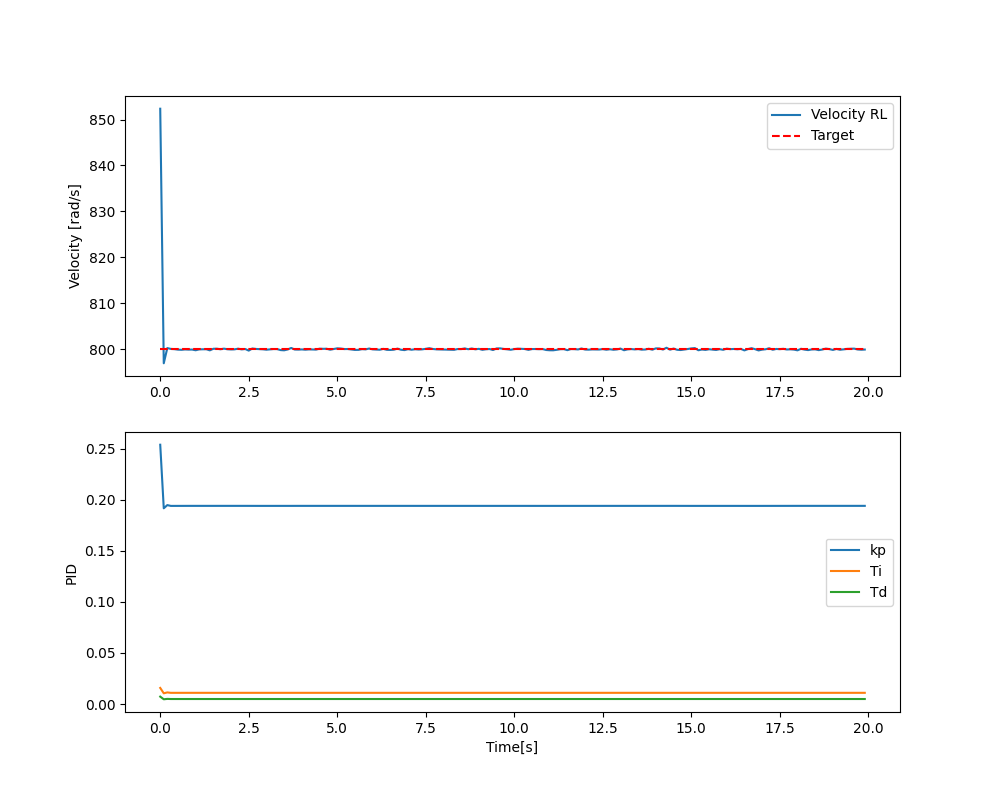
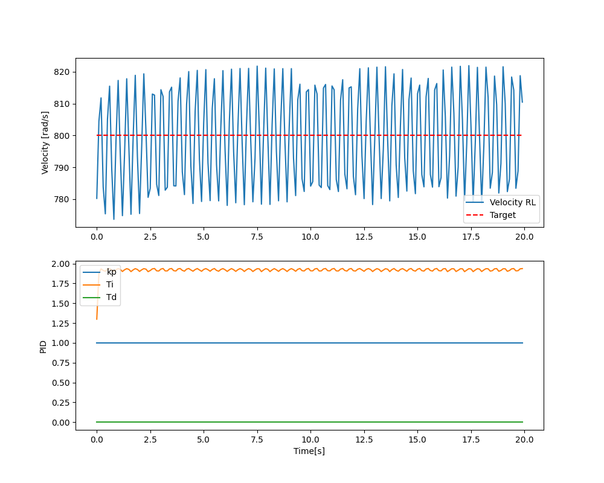
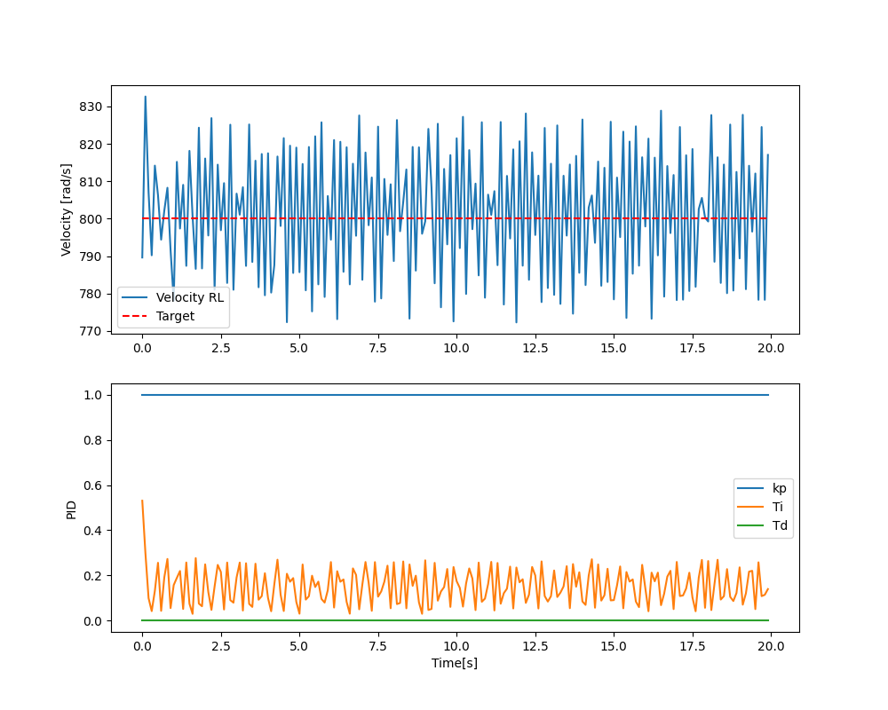
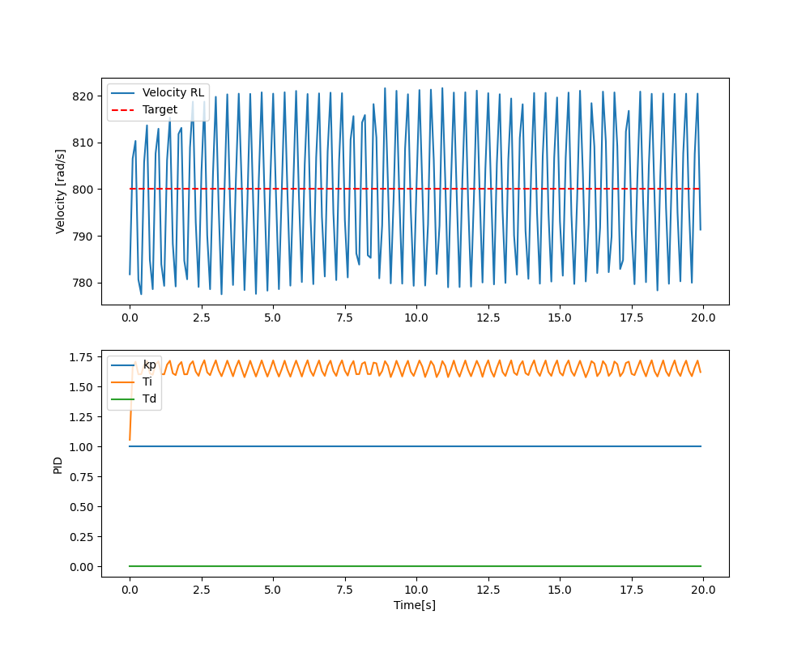
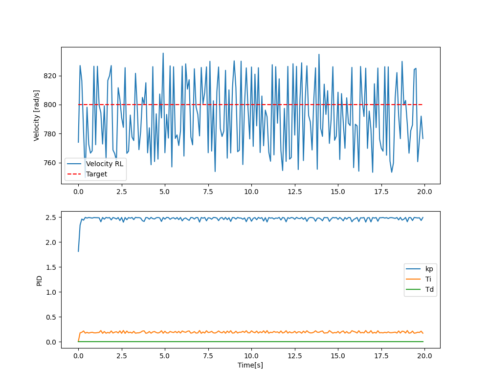
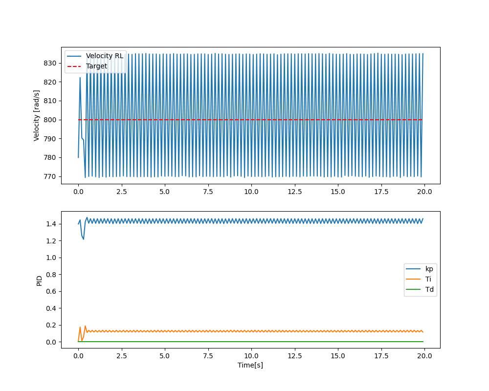
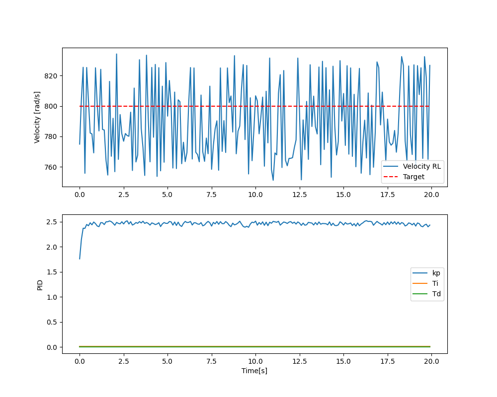
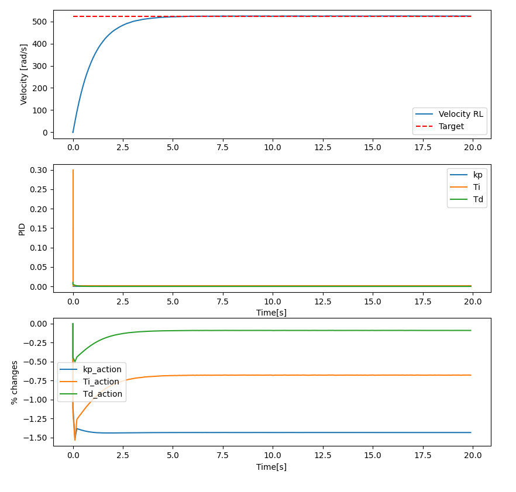
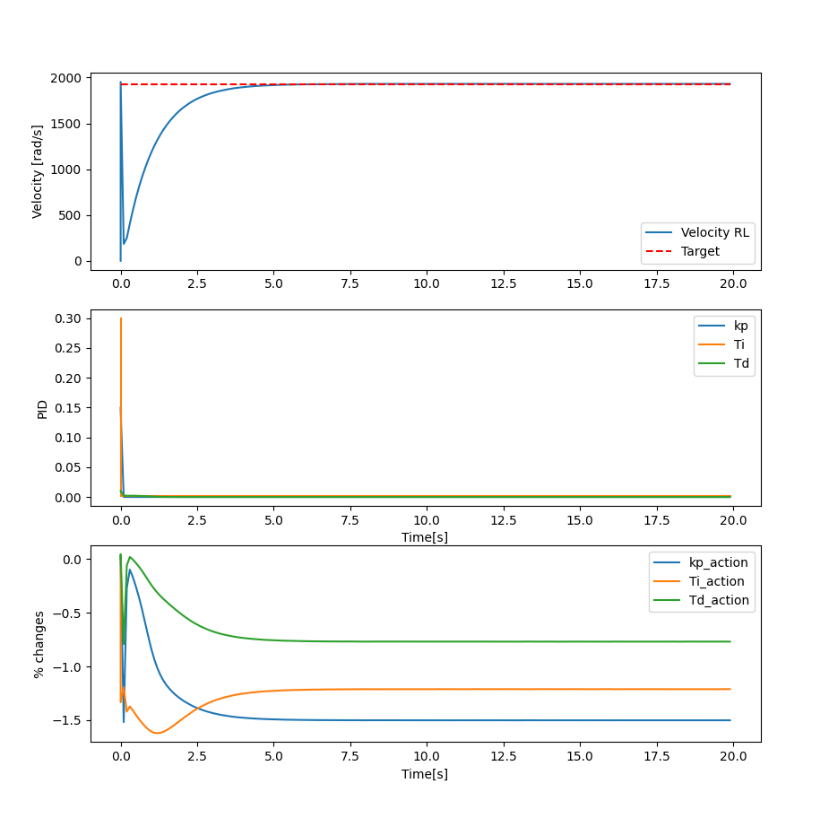

# Backlog of project work
- (DR) - Dawid Robak
- (KS) - Kacper Sułkowski

## Week: 2026-03-10 to 2026-03-17
- (DR) Created repo on git.
- (DR) Wrote project folders' struct, libs to use while developing project. 
- (DR) Created simple architecture of system.
- (DR) Wrote down task for first week.
- (DR) Added poetry to project
- (DR) Added class for BLDC -> math model
- (DR) Added noise for current and velocity of motor
- (DR) Added PID controller
- (DR) Added Gymnasium enviroment for BLDC motor in order to create enviroment for future agent
- (DR) Added tests for every class yet created
- (KS) Validated motor model
- (KS) Added code comments
- (KS) Added noise of motor voltage to model
- (KS) Modified reward function
- (KS) Added all observation channels to agent env
- (KS) Updated system arch diagram

## Week: 2026-03-18 to 2026-03-24
- (DR) Extracted reward func in gym env
- (DR) Created train file
- (DR) Chosen PPO algorithm for training
- (DR) Created test for model
- (DR) Added CI, changed test files for CI
- (KS) Changed PID integration method
- (KS) Added PID anti-windup clipping
- (KS) Changed PID output limit to object parameter
- (KS) Changed way of calculating ss description from tf transformation to explicite matrixes 
- (KS) Replacing calculating current draw with reading it from ss

## Week: 2026-03-25 to 2026-03-31
- (KS) Added external torque as model input
- (KS) Changed referential model parameters (2212 drone motor as reference)
- (KS) Changed PID structure from IND to ISA
- (KS) Adjusted referential PID settings
- (KS) Changed basic dt from 0.01s to 0.001s - the resolution was too low and PID bamboozled
- (KS) Changed obs and action limits, to match -10 to 10 range
- (KS) Added reward scaling (to avoid big numbers)
- (KS) Adjusted reward factors (high accuracy reward and error penalty) - after training with previous values result was highly oscilated (constant +-10%)
- (DR) Added colours for backlog
- (DR) Made step depend on dt in env
- (DR) Did some research about rl algorithms
- (DR) Added possibility of choosing algorithm while training or testing

<table style="width: 100%; border: none;">
  <tr>
    <td align="center" style="border: none;">
       
      <b>Dynamic SP 1</b>
    </td>
  </tr>
</table>

## Week: 2026-04-01 to 2026-04-14
- (DR) Changed sim step to be faster in calc (changed from control force resp to discrete)
- (DR) Added way of training with dynamic SP
- (DR) Added way of training with dynamic LOAD
- (DR) Added way of training with dynamic PARAMS (RLb)
- (DR) Made way of training on many CPUs
- (DR) Made BOM
- (DR) Added way of training many sessions on one model
- (DR) Added program for deleting dynamic models

<table style="width: 100%; border: none;">
  <tr>
    <td align="center" style="border: none;">
       
      <b>Dynamic SP 1</b>
    </td>
    <td align="center" style="border: none;">
       
      <b>Dynamic LOAD 1</b>
    </td>
  </tr>
  <tr>
    <td align="center" style="border: none;">
       
      <b>Dynamic PARAMS 1</b>
    </td>
    <td style="border: none;"></td>
  </tr>
</table>

## Week 2026-04-15 to 2026-04-21
- (DR) Added figs for first dynamic tests
- (DR) Train and test with different max Kp Ti Td (changed them) MAX: kp=10.o, ti = 0.5, td = 0.01
<table style="width: 100%; border: none;">
  <tr>
    <td align="center" style="border: none;">
       
      <b>Dynamic SP 2</b>
    </td>
    <td align="center" style="border: none;">
       
      <b>Dynamic LOAD 2</b>
    </td>
  </tr>
  <tr>
    <td align="center" style="border: none;">
       
      <b>Dynamic PARAMS 2</b>
    </td>
    <td style="border: none;"></td>
  </tr>
</table>

- (KS) Changed agent action from direct values to % change
- (KS) Changed CONST values
- (KS) Fixed scripts to pass tests
- (KS) Moved PID script from src to env
- (KS) Fixed test_rl plots
- (KS) Added randomization to test_rl call

<table style="width: 100%; border: none;">
  <tr>
    <td align="center" style="border: none;">
       
      <b>Trained: dynamic SP, Run witch random SP & params</b>
    </td>
  </tr>
</table>

<table style="width: 100%; border: none;">
  <tr>
    <td align="center" style="border: none;">
       
      <b>Trained: dynamic PARAMS, Run witch random SP & params</b>
    </td>
  </tr>
</table>

## Week 2026-04-22 to 2026-04-28
- (DR) Optimised way of training (now it doesnt save and load model constantly, it creates model,env one time, one time save)
- (DR) Added normal flags for testing (easy to choose rand sp,load,params etc.)
- (DR) Added possibility of floating SP in testing
- (DR) Added possibility of training with changing SP, PARAMS, LOAD in one time. After 1/3rd of all iteration it starts to change another thing. From start SP, then PARAMS, then LOAD
- (DR) Added function to evaluate agent controlling in changing sp environment
- (DR) Hotfix way of changing floating SP values

## Week 2026-04-29 to 2026-05-05

- (KS) Changed test_rl call arguments (n sp changes).
- (KS) Added randomization of sp change timestemps in test_rl.
- (KS) Chenged test_rl plots.
- (KS) Changed training plan - 30s runs from reset to reset
- (KS) Fixed malfuctioning training random ranges calculation (ctr+c ctrl+v typo).
- (KS) Changed PID gains limits.
- (KS) Added randomized SP changes during train run. 
- (KS) Packed env aim params into object.
- (KS) Fixed some errors in control eval function.

## Week 2026-05-06 to 2026-05-12

- (DR) Addd optimalization for learning rate, batch size, n_steps
- (DR) Add fixed evaluation based on ITAE and stabilization
- (DR) Got random optimalization:
==========
Best parameters: {'learning_rate': 6.445478386083428e-05, 'n_steps': 256, 'batch_size': 32}
Best score: 739.9384
==========

most important:
- learning rate (70%)
- n_steps (28%)
- batch_size (2%)

huge n_steps -> model needs motor to do more steps to be precise in controlling it
small learning_rate -> model needs to be precise in changing value, it cannot just fastly change values
small batch_size -> model desn't need to learn on chuge data at once, it need smaller parts of output

błąd: lip_range           | 0.2         |
|    entropy_loss         | -2.43       |
|    explained_variance   | 0.266       |
|    learning_rate        | 0.00118     |
|    loss                 | 0.0396      |
|    n_updates            | 490         |
|    policy_gradient_loss | -9.16e-05   |
|    std                  | 0.602       |
|    value_loss           | 0.0906      |
-----------------------------------------
 100% ━━━━━━━━━━━━━━━━━━━━━━━━━━━━━━━━━━━━━━━━━━━━━━━━━━━━━━━━━━━━━━━━━━━━━━━━━━━━━━━━━━━━━━━━━━━━━━━━━━━━━━━━━━━━━━━━━━━━━━━━━━━━━━━━━━━━━━━━━━━━━━━━━━━━━━━━━━━━━━━━━━━━━━━━━━━━━━━━━━━━━━ 30,720/30,000  [ 0:00:29 < 0:00:00 , 846 it/s ]
Testing with: SP=1000.0, LOAD=0.02
            : R=0.200, L=0.000500, b=0.000010
DEBUG: dt for calculating evaluation: 0.1
[I 2026-05-12 04:06:34,768] Trial 9 finished with value: 2234.477 and parameters: {'learning_rate': 0.0011829396044384206, 'n_steps': 512, 'batch_size': 32}. Best is trial 1 with value: 635.6678.
==========
Best parameters: {'learning_rate': 0.0012678873537958547, 'n_steps': 1024, 'batch_size': 32}
Best score: 635.6678
==========
Traceback (most recent call last):
  File "<frozen runpy>", line 198, in _run_module_as_main
  File "<frozen runpy>", line 88, in _run_code
  File "/home/suka/Dokumenty/AI/AD_raPIDas/src/opt_train.py", line 124, in <module>
    make_bayes_search()
  File "/home/suka/Dokumenty/AI/AD_raPIDas/src/opt_train.py", line 77, in make_bayes_search
    run_optimization(TPESampler(), "bayes_search_ppo")
  File "/home/suka/Dokumenty/AI/AD_raPIDas/src/opt_train.py", line 58, in run_optimization
    save_study_plots(study=study_name)
  File "/home/suka/Dokumenty/AI/AD_raPIDas/src/opt_train.py", line 65, in save_study_plots
    vis.plot_optimization_history(study).write_html(f"opt_plots/{study}_history.html")
    ^^^^^^^^^^^^^^^^^^^^^^^^^^^^^^^^^^^^
  File "/home/suka/Dokumenty/AI/AD_raPIDas/.venv/lib/python3.12/site-packages/optuna/visualization/_optimization_history.py", line 202, in plot_optimization_history
    info_list = _get_optimization_history_info_list(study, target, target_name, error_bar)
                ^^^^^^^^^^^^^^^^^^^^^^^^^^^^^^^^^^^^^^^^^^^^^^^^^^^^^^^^^^^^^^^^^^^^^^^^^^
  File "/home/suka/Dokumenty/AI/AD_raPIDas/.venv/lib/python3.12/site-packages/optuna/visualization/_optimization_history.py", line 53, in _get_optimization_history_info_list
    _check_plot_args(study, target, target_name)
  File "/home/suka/Dokumenty/AI/AD_raPIDas/.venv/lib/python3.12/site-packages/optuna/visualization/_utils.py", line 60, in _check_plot_args
    if target is None and any(study._is_multi_objective() for study in studies):
                          ^^^^^^^^^^^^^^^^^^^^^^^^^^^^^^^^^^^^^^^^^^^^^^^^^^^^^
  File "/home/suka/Dokumenty/AI/AD_raPIDas/.venv/lib/python3.12/site-packages/optuna/visualization/_utils.py", line 60, in <genexpr>
    if target is None and any(study._is_multi_objective() for study in studies):
                              ^^^^^^^^^^^^^^^^^^^^^^^^^
AttributeError: 'str' object has no attribute '_is_multi_objective'
(ad-rapidas-py3.12) suka@witek:~/Dokumenty/AI/AD_raPIDas$ 
(ad-rapidas-py3.12) suka@witek:~/Dokumenty/AI/AD_raPIDas$ 
(ad-rapidas-py3.12) suka@witek:~/Dokumenty/AI/AD_raPIDas$ 

Testing with: SP=1000.0, LOAD=0.02
            : R=0.200, L=0.000500, b=0.000010
DEBUG: dt for calculating evaluation: 0.1
[I 2026-05-12 05:07:17,497] Trial 19 finished with value: 857.9875 and parameters: {'learning_rate': 0.0006130390479189377, 'n_steps': 1024, 'batch_size': 128}. Best is trial 1 with value: 635.6678.
==========
Best parameters: {'learning_rate': 0.0012678873537958547, 'n_steps': 1024, 'batch_size': 32}
Best score: 635.6678
==========
Traceback (most recent call last):
  File "<frozen runpy>", line 198, in _run_module_as_main
  File "<frozen runpy>", line 88, in _run_code
  File "/home/suka/Dokumenty/AI/AD_raPIDas/src/opt_train.py", line 124, in <module>
    make_bayes_search()
  File "/home/suka/Dokumenty/AI/AD_raPIDas/src/opt_train.py", line 77, in make_bayes_search
    run_optimization(TPESampler(), "bayes_search_ppo")
  File "/home/suka/Dokumenty/AI/AD_raPIDas/src/opt_train.py", line 58, in run_optimization
    save_study_plots(study=study_name)
  File "/home/suka/Dokumenty/AI/AD_raPIDas/src/opt_train.py", line 65, in save_study_plots
    vis.plot_optimization_history(study).write_html(f"opt_plots/{study}_history.html")
    ^^^^^^^^^^^^^^^^^^^^^^^^^^^^^^^^^^^^
  File "/home/suka/Dokumenty/AI/AD_raPIDas/.venv/lib/python3.12/site-packages/optuna/visualization/_optimization_history.py", line 202, in plot_optimization_history
    info_list = _get_optimization_history_info_list(study, target, target_name, error_bar)
                ^^^^^^^^^^^^^^^^^^^^^^^^^^^^^^^^^^^^^^^^^^^^^^^^^^^^^^^^^^^^^^^^^^^^^^^^^^
  File "/home/suka/Dokumenty/AI/AD_raPIDas/.venv/lib/python3.12/site-packages/optuna/visualization/_optimization_history.py", line 53, in _get_optimization_history_info_list
    _check_plot_args(study, target, target_name)
  File "/home/suka/Dokumenty/AI/AD_raPIDas/.venv/lib/python3.12/site-packages/optuna/visualization/_utils.py", line 60, in _check_plot_args
    if target is None and any(study._is_multi_objective() for study in studies):
                          ^^^^^^^^^^^^^^^^^^^^^^^^^^^^^^^^^^^^^^^^^^^^^^^^^^^^^
  File "/home/suka/Dokumenty/AI/AD_raPIDas/.venv/lib/python3.12/site-packages/optuna/visualization/_utils.py", line 60, in <genexpr>
    if target is None and any(study._is_multi_objective() for study in studies):
                              ^^^^^^^^^^^^^^^^^^^^^^^^^
AttributeError: 'str' object has no attribute '_is_multi_objective'
